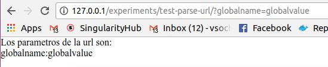
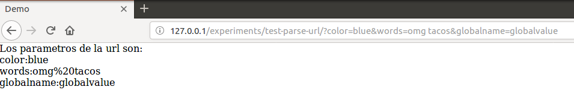

# Building Instructions

The Dockerfile here will build the experiment `test-parse-url` from the 
repository, along with a simple test task. We do this to demonstrate
how expfactory can read variables for an experiment from a custom text file.

```
docker build -t vanessa/test-parse-url .
```

For complete instructions for how to interact with specifying variables (such
as with the provided file [variables.tsv](variables.tsv)) please see our 
[usage documentation](https://expfactory.github.io/expfactory/usage). We will provide
a brief overview here.

## Variable File
Your file should be a comma separated value (csv) file, such as with the 
example below that is provided here in [variables.csv](variables.csv):

```
exp_id,var_name,var_value,token
test-parse-url,globalname,globalvalue,*
test-parse-url,color,red,123
test-parse-url,color,blue,456
test-parse-url,words,at the thing,123
test-parse-url,words,omg tacos,456
```

The first row is non negoatiable - it *must* have four fields, in that order, 
and name. The fields are the following:

 - **exp_id** The Experiment Factory identifier that identifies the experiment
 - **var_name** The variable name to pass into the url
 - **var_value** the variable_value to pass
 - **token** the subject token to pass for. If a particular combination of exp_id and token is seen twice, a warning will be issued and the later defined taken preference. If you set token to "*" it will be treated as a global variable, and set for all subject ids (also defined in the file) that do not have a previously defined value for the variable in question. 


```
<base-url>/experiments/<exp_id>?<var_name>=<var_value>
```
and so multiple variables for one subject:

```
<base-url>/experiments/<exp_id>?<var_name1>=<var_value1>&<var_name2>=<var_value2>
```

The parameters are simply passed to the experiment, and the experiment is expected to parse them
appropriately.


## Start the Container
If we start the container without defining runtime variables, we don't get any special behavior:

```
docker run -p 80:80 vanessa/test-parse-url  start
Database set as filesystem
Starting Web Server

 * Starting nginx nginx
   ...done.
==> /scif/logs/gunicorn-access.log <==
```

If you go to your browser, enter the portal, and start the experiment, you will see a dummy experiment that doesn't do anything but print the variable name and values to the screen. In this case, we don't have any!


This is actually a good opportunity to understand how this demo experiment is working. It's just taking variables from the URL and printing them out. You can define them as you please by typing key,value pairs into the bar: The first is separated from the url by a question mark (`?`)


and subsequent variables are separated by way of an and `&`


## Specify a Variable File
If we define the `--vars` argument, we can define a custom variable file! But be careful, remember that this file is on your local host, and not in the container. Let's see what happens if we do it anyway.

```
docker run -p 80:80 vanessa/test-parse-url  --vars variables.csv start
WARNING: Cannot find variables.csv
Database set as filesystem
Starting Web Server

 * Starting nginx nginx

```

You'll notice the warning above that it wasn't found! Let's instead map the present working directory ($PWD) to the container, and then specify the file path *in the container*

```
docker run -v $PWD:/scif/data -p 80:80 vanessa/test-parse-url  --vars /scif/data/variables.csv start
Found Variable File: /scif/data/variables.csv
Database set as filesystem
Starting Web Server

```

Hooray! Now we are found! Now let's look again at our variables file to set our expectations correctly. We have defined one global variable, `globalname` for the experiment `test-parse-uri` that is identified by the `*` presence for the token. This means that, given that we haven't identified the variable for any specific subject id, it will be set to the default. This also means that, since this experiment is being run without pre-generating identifiers in advance (something done with a headless start) we are only going to be able to set experiment variables via url parameters via these global ones.

```
exp_id,var_name,var_value,token
test-parse-url,globalname,globalvalue,*
test-parse-url,color,red,123
...
```

Now if we again take the experiment, once we hit the `test-parse-url` experiment, regardless of the participant id, we are going to see the variable passed on via the url:



And this is the method you can use to pass custom global variables to experiments. At this point, the code in the JavaScript of the experiment would be responsible for parsing the url variables, and acting appropriately.

## Specify Participants
In the case that you want to specify participant IDs in advance, you would need to start the container, create the identifiers, update the file, and restart. We require a restart so that it is never the case that a data file suddenly changes and the deployed experiment is touched. First, start a container in detached mode. The `-d` means detached.


```
docker run -d -v $PWD:/scif/data -p 80:80 vanessa/test-parse-url start
```

You can see the container with `docker ps`

```
CONTAINER ID        IMAGE                    COMMAND                  CREATED             STATUS              PORTS                          NAMES
d8c612e0dfa2        vanessa/test-parse-url   "/bin/bash /startscr…"   3 seconds ago       Up 2 seconds        0.0.0.0:80->80/tcp, 5000/tcp   happy_haibt
vanessa@vanessa-Th
```

List your users by issuing a command to the container. At the onset there should be none.

```
docker exec d8c612e0dfa2 expfactory users --list
```

(The above should return an empty response). Now create three new users:

```
docker exec d8c612e0dfa2 expfactory users --new 3
exec d8c612e0dfa2 expfactory users --list
/scif/data/expfactory/017305e8-7eba-4d43-bc81-e95f5ceab0a8	017305e8-7eba-4d43-bc81-e95f5ceab0a8[active]
/scif/data/expfactory/275ae6ea-5d33-499e-a3db-2bbcc4881ff4	275ae6ea-5d33-499e-a3db-2bbcc4881ff4[active]
/scif/data/expfactory/a737a811-1bcc-449c-b0b0-9acded60bbd9	a737a811-1bcc-449c-b0b0-9acded60bbd9[active]
```

You can now edit your data file and set the tokens to have custom variables and values. Here is the content of [custom-variables.csv](custom-variables.csv)

```
exp_id,var_name,var_value,token
test-parse-url,globalname,globalvalue,*
test-parse-url,color,red,017305e8-7eba-4d43-bc81-e95f5ceab0a8
test-parse-url,color,blue,275ae6ea-5d33-499e-a3db-2bbcc4881ff4
test-parse-url,words,at the thing,017305e8-7eba-4d43-bc81-e95f5ceab0a8
test-parse-url,words,omg tacos,275ae6ea-5d33-499e-a3db-2bbcc4881ff4
```
Now we can stop the container and restart it with the file specified. We will start in headless mode and pretend to be a participant, copy pasting the id into the browser. For this step, be careful that you are either using a database that is mapped to the host, e.g.:

```
$  ls expfactory/
017305e8-7eba-4d43-bc81-e95f5ceab0a8  275ae6ea-5d33-499e-a3db-2bbcc4881ff4  a737a811-1bcc-449c-b0b0-9acded60bbd9
```

or that your database (postgres or other) is specified outside the container. If you create participants and stop the container, the participants you make may not persist depending on your setup.

```
docker run -d -v $PWD:/scif/data -p 80:80 vanessa/test-parse-url --vars /scif/data/custom-variables.csv --headless start
```

Make sure to open the experiment in a new browser tab, in case you have any previous sessions (data in the browser cache). When we enter one of our participant identifiers, we see the variables passed on!


